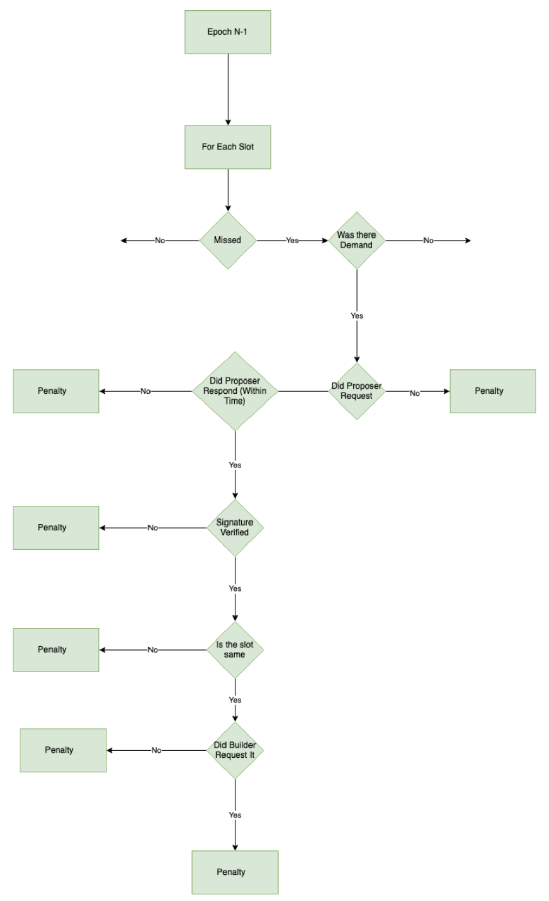

# Proof of Neutrality Reporter

## What is a Reporter?

In the Proof of Neutrality (PoN) relay, a reporter plays a critical role in maintaining the integrity and security of the protocol. The primary function of a reporter is to scrutinize the activities of proposers and builders, ensuring that they adhere to the rules and regulations of the network.

Through a process of consistent monitoring and validation, reporters act as watchdogs for the PoN Relay, providing an independent and impartial assessment of the actions of proposers and builders. In doing so, they help to ensure that the network remains secure and trustworthy, and that any wrongdoing is detected, reported, and met with consequences.

Reporters are incentivized with rewards for reporting wrongdoing, taking a portion of funds from the reported party and splitting it with the payout pool. By collecting these rewards, reporters stay motivated to remain vigilant and ensure the continued success of the PoN Relay.

The PoN Relay and Adaptive PBS Smoothing Pool rely on reporters to ensure compliance with PBS rules. If a proposer misses a slot or fails to propose a committed block, participants in the PoN Relay also miss out on rewards. Reporters monitor for rule violations and report any misbehavior with builders and proposers. A builder can accrue debt and become non-operational until the debt is repaid, while a proposer will be in operation until it exits or gets kicked out.

The reporter of the PBS rule violation is rewarded with half of the reported penalty. The remaining half is distributed among the validators. Penalty rewards can be claimed after 100 blocks from the last report and come from the Payout Pool.

## Penalties



The Penalties Can Be Divided Into Broadly 3 Types-
- Validator Fault
- Builder Fault
- Validator Fault And Kicking

### Validator Fault
These are the penalties in which validators are at fault and the penalties will be for the proposers. Proposers are penalised and 50% of penalty goes to reporter and 50% to rest of proposers in payout pool.

Validators can be at fault for the following reasons:
- Not requesting a header from the relayer where a bid was made
  - Internal penalty type: `PROPOSER_OFFLINE`
- Requesting a header from a relayer and not signing the header
  - Internal penalty type: `PROPOSER_DID_NOT_SIGN`

All internal types for the proposer map onto the smart contract enum with a value of `0`.

### Builder Fault
These are the penalties in which the builder is at fault and penalties are charged from the stake deposited by the builders at the time of registration. These penalties are when the builder commits to a slot but doesn't request the block or publish as in PoN block is proposed by the builder.

Builder can be at fault for:
- Making an under payment to the payout pool or alternative fee recipient
  - Internal penalty type: `BUILDER_UNDERPAYMENT`
- Not publishing a block to the chain - they have the full contents and no one else until the header is signed.
  - Internal penalty type: `BUILDER_DIDNT_PUBLISH`

All internal types for the builder map onto the smart contract enum with a value of `1`. 

### Validator Fault And Kicking
These are the penalties where the proposers are being kicked from Ethereum and PoN - either they were slashed or their effective balance fell below 32 ETH.

This maps to the internal penalty type: `PROPOSER_SLASHED_OR_LOW_EFFECTIVE`

This internal type for the proposer maps onto the smart contract enum with a value of `2`.

## Before getting started

Install the node dependencies at the root of the repo using yarn
```
yarn
```

## Scanning for penalties in the network

The reporting software allows scanning for PBS violations on a per epochal basis for a past epoch on the consensus layer.

#### This is the service found in `src/scanner-api`.

In order to run the API, the environment needs to be defined as per the `.env.example` file. For example:
```
EXECUTION_LAYER_PROVIDER=
PAYOUT_POOL_URL=
BEACON_URL=
RELAY_URL=
PAYOUT_POOL_ADDRESS=
PROPOSER_REGISTRY=
```

then the dependencies need to be installed. Yarn is recommended:
```
yarn
```

and finally, you can spin it up with:
```
node index.js
```

where you would see something like this:
```
Server is Successfully Running, and App is listening on port 1212
```

### Example Network Scan With Underpayment penalties

Lets go through an example where we scan for PBS violations for a specific epoch that is in the past. Note, only epochs that have reach finality should be scanned.

#### Query URL
```
http://localhost:1212/scan?epoch=44
```

### Query type
```
GET
```

### Example Response
```
{
    "epoch": "44",
    "listOfViolations": {
        "penaltiesForInvalidBuilderPayment": [
            {
                "blsKey": "0xa3a32b0f8b4ddb83f1a0a853d81dd725dfe577d4f4c3db8ece52ce2b026eca84815c1a7e8e92a4de3d755733bf7e4a9b",
                "builder": "0x22a3864baae65a9e8e5c163f80f850adfe40ed90",
                "slot": "1411",
                "block": "1368",
                "penaltyType": "1",
                "amount": "82000000000000000",
                "internalPenaltyType": "BUILDER_UNDERPAYMENT",
                "relayUrl": "http://localhost:9001",
                "rpbs": {
                    "BuilderPubkey": "0x22a3864baae65a9e8e5c163f80f850adfe40ed90",
                    "BuilderSignature": "0x2e926be95496c5ad7ee0e2ea74cf0310204dcb60527fa6735db064a96f5177407a80357f1256e854c194aa4cb6970d6bf173d3a26895fabecdeef681ba84558201",
                    "signature": "{\"z1Hat\":\"64041379f10a88f2870836f55fff71766657383fcf879376ececbb9eab0387c0a22428c22bdf56145405cfb9e9c626bb96f32660c5455f0d910269a4f3be5c73ac5c\",\"c1Hat\":\"2e6492ac7d804fbd64ac5d49da51bb5e288e1e49a8fd7899a9012e319582461c\",\"s1Hat\":\"0483e909519cebac7e0ac09c02fb8b32484ec50bc5f01f37f6b9228e4ac5f345\",\"c2Hat\":\"15b2d89b1533ec7126caa45d232c79e22361abb64a62f1c0a9afa087a9f0e7e1\",\"s2Hat\":\"2c4761a4b3cd776f4615dfd8e3272b44060ac072b93052f5b50e3416539aca27\",\"m1Hat\":\"640429c58773425723955dcde7db7cfa8307fdfcdb6b3a84230e5f8966d065c17d671bf1370f0e2a325e63ec5467e86b170f3ff8e7786145efa0bf2954aff0630fda\"}",
                    "RpbsPublicKey": "64041c2a8e7055412f848a7c05f87c0a381cd2c2113a31beabf5fdec6d7e08d5a1bc26e312f90957a65669259da82e61ff0f2f085a780727fd5d05407336111d4e6b",
                    "TransactionByte": "0xf86b8201c008830493e094b32c5561ef6ea573cd567b1ca0796bab65dd4ec5872386f26fc0ffff80822148a07c0ac0495aae205bf028e361f1db9d492c3ed8de0766fde9c3de592c03a85309a048f56dc878fdc759f38f0c7bf1143f8976926c8413132e7e394914fed4d8ff98",
                    "Value": 40050000000000000
                },
                "additionalData": {
                    "payment": "9999999999999999",
                    "expectedPayment": "41000000000000000"
                }
            }
        ],
        "penaltiesForProposersOffline": [],
        "penaltiesForProposerNoSignedHeaderReturned": [],
        "penaltiesForBuildersNotPublishing": [],
        "penaltiesForProposersSlashed": [],
        "currentEpoch": "50"
    }
}
```

## Getting Penalties verified

A proof of neutrality network will assign a single or set of designated verifiers that will perform the role of penalty verification.

#### This is the service found in `src/verification-api`.

It will perform the role of verifying that the events detected by reporters through scanning the network have not been falsified.

## Getting started

### Query URL
```
http://localhost:9565/validate
```

### Query type
```
POST
```

### Example POST body
```
{
    "reports": [
        {
                "blsKey": "0xb89bebc699769726a318c8e9971bd3171297c61aea4a6578a7a4f94b547dcba5bac16a89108b6b6a1fe3695d1a874a0b",
                "builder": "0x0000000000000000000000000000000000000000",
                "slot": "384",
                "block": "370",
                "penaltyType": "2",
                "amount": "0",
                "internalPenaltyType": "PROPOSER_SLASHED_OR_LOW_EFFECTIVE",
                "relayUrl": "http://localhost:9001",
                "rpbs": null,
                "additionalData": {}
            },
        {
                "blsKey": "0x88c141df77cd9d8d7a71a75c826c41a9c9f03c6ee1b180f3e7852f6a280099ded351b58d66e653af8e42816a4d8f532e",
                "builder": "0x22a3864baae65a9e8e5c163f80f850adfe40ed90",
                "slot": "384",
                "block": "370",
                "penaltyType": "1",
                "amount": "82000000000000000",
                "internalPenaltyType": "BUILDER_UNDERPAYMENT",
                "relayUrl": "http://localhost:9001",
                "rpbs": {
                    "BuilderPubkey": "0x22a3864baae65a9e8e5c163f80f850adfe40ed90",
                    "BuilderSignature": "0x1a5b3042830f8cea4af4c406fcf951177a3c1ea3a7cf6a13e50d06462f88958c1337c4623d51cac76f1b4e4c5ae818850734faaba639420b6c617fdd302747a301",
                    "signature": "{\"z1Hat\":\"64041bd7821b69e0c91ed78d5910ab9fe3682726ddbebe02992ab9ed067f87b40f912488715ec204b2cdbd09e096488b0a84c49dcc315d5e870800fa65be9b64689c\",\"c1Hat\":\"1a3234d63f61b72786bd5ae38c51be09b94c1f1618948f9e99b7d421d4ece117\",\"s1Hat\":\"0b111423a95efef2fa4b853108995b92f23045a82294cd2f18b52ff61f4418cd\",\"c2Hat\":\"25b9074d30dbf7635df9ac0734e5e033da78d4804b0f97e2f15b4b0063a20641\",\"s2Hat\":\"2531be5960cf629ec2a533df326e31e971b5c1bac302fb0d37409c07fd195cf9\",\"m1Hat\":\"63040226bccc343da298be5d20ecaa265a5f24306697af12991df977214fcee055511d61ea65424fbf264abff4de50c7fa9faffa2ecd0580a2631cf1cfbe79f745de\"}",
                    "RpbsPublicKey": "64041c2a8e7055412f848a7c05f87c0a381cd2c2113a31beabf5fdec6d7e08d5a1bc26e312f90957a65669259da82e61ff0f2f085a780727fd5d05407336111d4e6b",
                    "TransactionByte": "0xf8695108830493e094b32c5561ef6ea573cd567b1ca0796bab65dd4ec5872386f26fc0ffff80822147a0cbe97d22c37efa37ef9a3b406e56e53ef522e2d8f9d7f0192c09f30c556a3b36a07d3c5f17164eadfcac892376075f934f9caa804c3844a482ff26c523a291f081",
                    "Value": 41000000000000000
                },
                "additionalData": {
                    "payment": "9999999999999999",
                    "expectedPayment": "41000000000000000"
                }
            }
    ]
}
```

### Example Response
```
{
    "reports": [
        {
            "blsKey": "0xb89bebc699769726a318c8e9971bd3171297c61aea4a6578a7a4f94b547dcba5bac16a89108b6b6a1fe3695d1a874a0b",
            "builder": "0x0000000000000000000000000000000000000000",
            "slot": "384",
            "block": "370",
            "penaltyType": "2",
            "amount": "0",
            "signature": "0x"
        },
        {
            "blsKey": "0x88c141df77cd9d8d7a71a75c826c41a9c9f03c6ee1b180f3e7852f6a280099ded351b58d66e653af8e42816a4d8f532e",
            "builder": "0x22a3864baae65a9e8e5c163f80f850adfe40ed90",
            "slot": "384",
            "block": "370",
            "penaltyType": "1",
            "amount": "82000000000000000",
            "signature": "0x3634303431626437383231623639653063393165643738643539313061623966653336383237323664646265626530323939326162396564303637663837623430663931323438383731356563323034623263646264303965303936343838623061383463343964636333313564356538373038303066613635626539623634363839633a316133323334643633663631623732373836626435616533386335316265303962393463316631363138393438663965393962376434323164346563653131373a306231313134323361393565666566326661346238353331303839393562393266323330343561383232393463643266313862353266663631663434313863643a323562393037346433306462663736333564663961633037333465356530333364613738643438303462306639376532663135623462303036336132303634313a323533316265353936306366363239656332613533336466333236653331653937316235633162616333303266623064333734303963303766643139356366393a363330343032323662636363333433646132393862653564323065636161323635613566323433303636393761663132393931646639373732313466636565303535353131643631656136353432346662663236346162666634646535306337666139666166666132656364303538306132363331636631636662653739663734356465"
        }
    ],
    "reportsWithMetadata": [
        {
            "blsKey": "0xb89bebc699769726a318c8e9971bd3171297c61aea4a6578a7a4f94b547dcba5bac16a89108b6b6a1fe3695d1a874a0b",
            "builder": "0x0000000000000000000000000000000000000000",
            "slot": "384",
            "block": "370",
            "penaltyType": "2",
            "amount": "0",
            "internalPenaltyType": "PROPOSER_SLASHED_OR_LOW_EFFECTIVE",
            "relayUrl": "http://localhost:9001",
            "rpbs": null,
            "additionalData": {}
        },
        {
            "blsKey": "0x88c141df77cd9d8d7a71a75c826c41a9c9f03c6ee1b180f3e7852f6a280099ded351b58d66e653af8e42816a4d8f532e",
            "builder": "0x22a3864baae65a9e8e5c163f80f850adfe40ed90",
            "slot": "384",
            "block": "370",
            "penaltyType": "1",
            "amount": "82000000000000000",
            "internalPenaltyType": "BUILDER_UNDERPAYMENT",
            "relayUrl": "http://localhost:9001",
            "rpbs": {
                "BuilderPubkey": "0x22a3864baae65a9e8e5c163f80f850adfe40ed90",
                "BuilderSignature": "0x1a5b3042830f8cea4af4c406fcf951177a3c1ea3a7cf6a13e50d06462f88958c1337c4623d51cac76f1b4e4c5ae818850734faaba639420b6c617fdd302747a301",
                "signature": "{\"z1Hat\":\"64041bd7821b69e0c91ed78d5910ab9fe3682726ddbebe02992ab9ed067f87b40f912488715ec204b2cdbd09e096488b0a84c49dcc315d5e870800fa65be9b64689c\",\"c1Hat\":\"1a3234d63f61b72786bd5ae38c51be09b94c1f1618948f9e99b7d421d4ece117\",\"s1Hat\":\"0b111423a95efef2fa4b853108995b92f23045a82294cd2f18b52ff61f4418cd\",\"c2Hat\":\"25b9074d30dbf7635df9ac0734e5e033da78d4804b0f97e2f15b4b0063a20641\",\"s2Hat\":\"2531be5960cf629ec2a533df326e31e971b5c1bac302fb0d37409c07fd195cf9\",\"m1Hat\":\"63040226bccc343da298be5d20ecaa265a5f24306697af12991df977214fcee055511d61ea65424fbf264abff4de50c7fa9faffa2ecd0580a2631cf1cfbe79f745de\"}",
                "RpbsPublicKey": "64041c2a8e7055412f848a7c05f87c0a381cd2c2113a31beabf5fdec6d7e08d5a1bc26e312f90957a65669259da82e61ff0f2f085a780727fd5d05407336111d4e6b",
                "TransactionByte": "0xf8695108830493e094b32c5561ef6ea573cd567b1ca0796bab65dd4ec5872386f26fc0ffff80822147a0cbe97d22c37efa37ef9a3b406e56e53ef522e2d8f9d7f0192c09f30c556a3b36a07d3c5f17164eadfcac892376075f934f9caa804c3844a482ff26c523a291f081",
                "Value": 41000000000000000
            },
            "additionalData": {
                "payment": "9999999999999999",
                "expectedPayment": "41000000000000000"
            }
        }
    ],
    "designatedVerifierSignatures": [
        {
            "v": 28,
            "r": "0x69096107110c4748fce101f4119c471adfc0ef00031f2b61c158f882f1574fa2",
            "s": "0x251e7c10b95d931a0674e9ff268efa2c39807f779a74efb79ce149b6129318bc"
        },
        {
            "v": 27,
            "r": "0x788dc80650580e5d205a249e9944ee45c11ebcbc4c90a7a61c4e41a39adbea7b",
            "s": "0x50b7f39497dd4e12e5a202327f5170cb884948564bf69aa47ef84835029c763a"
        }
    ]
}
```

## Using the PoN SDK

The process of reporting penalties to the PoN smart contracts in order to be paid can be made easier using the PoN SDK.

Install it as follows:
```
npm i @blockswaplab/pon-sdk
```

### Example script that scans for violations, gets verified and submits it to the smart contracts

```
const pSDK = new PoNSdk(ethersSigner)

const violations = await pSDK.reporterRegistry.scanForPBSViolations('http://localhost:1212', 47)
console.log(
    'scan',
    violations
)

const penalties = [
    ...violations.listOfViolations.penaltiesForInvalidBuilderPayment,
    ...violations.listOfViolations.penaltiesForProposerNoSignedHeaderReturned
]

const verification = await pSDK.reporterRegistry.verifyPBSViolations('http://localhost:9565', penalties)
console.log(verification)

// The last parameter indicates you want to proceed with withdrawal of ETH accrued from reporting other penalties that are at least 100 blocks ago
const tx = await pSDK.reporterRegistry.report(verification, true)
console.log('Transaction hash', tx.hash);
```

### Note: you need to be registered in the reporter registry in order to report PBS violations
You can perform registration in the reporter registry using the SDK:
```
// msg.sender will be registered as a reporter - just pay the gas and thats it!
await pSDK.reporterRegistry.registerReporter()
```